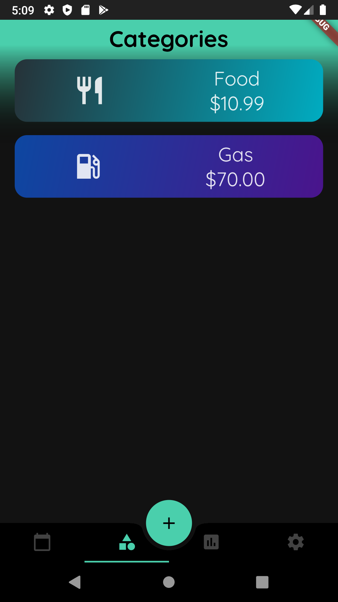

# Spending Tracker 

## Table of Contents

- [Android Version](#android-version)
- [About](#about)
- [Data Storage](#data-storage)
- [Screenshots](#screenshots)
- [Todo](#todo)
- [Version History](#version-history)

## Android Version

The minimum android version this application supports is Android 9 (targetSdkVersion = 28).

## About

This app was built to help people keep track of their monthly spending. On the main screen, there is a top row of categories that the user creates to help them organize their transactions. The middle section of the screen contains the information about the current month and how much they spent that month. To the left and right of the month are chevrons to help users navigate between each month.

## Data Storage

There are currently two SQFLite database tables in this application.

### Category Table

This table contains the information about the categories that the user creates. This includes name, icon to represent the category, and two colors for displaying in the category page.

### Transactions Table

This table stores transaction that the user adds. This includes the name, description, amount, category, and date. The date is stored as an integer of milliseconds since epoch.

### Query

Querying of transactions can be filtered by using either the date represented as an integer or by category and date as an integer.

## Screenshots

### 1 - First Install

When first installing the app, there will be no categories or transactions and will show an empty page.

### 2 - Add Category

When pressing Add Category or going to Settings > Cateogry Management, you will be directed to the screen shown. This screen lets the user add their custom Category, choose up to two colors, and choosing an icon.

### 3 - Pick Color

When the user decides to choose a color, this will be the screen that be shown to allow user to set the color of the Category square.

### 4 - Pick Icon

This screenshot shows some of the icons the user can choose from.

### 5 - After Adding Category

After adding a category, the category will be listed below. There is an edit button and a delete button to delete the category and all associated transactions.

### 6 - Edit Category

This screen allows the user to edit the color and/or icon.

### 7 - Main Tab after Adding Categories

After adding the categories, they will now be displayed at the top.

### 8 - Add Transaction

This screen allows the user to add a transaction with a corresponding category and date.

### 9 - Main Tab - Transaction Overview

After adding transactions, they will show up in the main tab, sorted by date. The example shown is the transactions for the month of Feb 2020.

### 10 - Second Tab - Category List

This is a list of all the categories for the the month of Feb and the totals of each category.

### 11 - Third Tab - Monthly Overview

This third tab shows an overview of the past 12 months. The user can also select how many months to display.

### 12 - Fourth Tab - Settings

The last tab contains the settings to add, edit, and delete categories and also allows the user to reorganize how the categories are displayed.

### 13 - Reorganize Categories

Users can choose which categories to be displayed in what order.

### 14 - Main Tab

When there are a lot of transactions, the month at the top will shrink as you scroll down.

### 15 - Selecting Month and Year

Allows user to quick select a particular month and particular year to display transactions when pressing on the date on the Main Tab.

## TODO

- [ ] back up storage options other than firebase (medium)
- [ ] add firebase functionality (for backup storage and data restore) (low)
- [ ] theme: ability to change colors (low)
- [ ] add animations (low)
- [ ] ability to set budget (low)

## Version History

### V0.9.4 (Jan 11, 2020)

- can no longer use back gestures or back buttons from the Android system to go back, must use the back buttons provided in application
- added AboutListTile
- added an 'Add Category' tile to the Category overview page if there is no Categories

### V0.9.3 (Dec 14, 2019)

- when pressing Add button, will auto fill in the Date and/or Category where possible
- set a forward and backward date limit
- adjusted error font size
- created analytics page
- increased icon size in CategoriesRow widget

### V0.9.2 (Nov 30, 2019)

- removed bouncing scroll on main screen
- fixed date render bug on categories view
- can rearrange categories
- updated categories database to version 2
- changed CategoryOverviewCard from square grid to listview widget

### V0.9.1 (Nov 22, 2019)

- changed which widgets will reloaded when notifyListener is called
- added snackbar confirmation when adding a transaction
- added a dialog window to quickly change month and year
- changed font to Quicksand

### V0.9.0 (Nov 17, 2019)

- first build candidate
- can add categories
- can add transactions
- can query transactions
- changed UI compared to Spending Tracker V1
- made creating monthly transaction object simpler
- added unit tests
